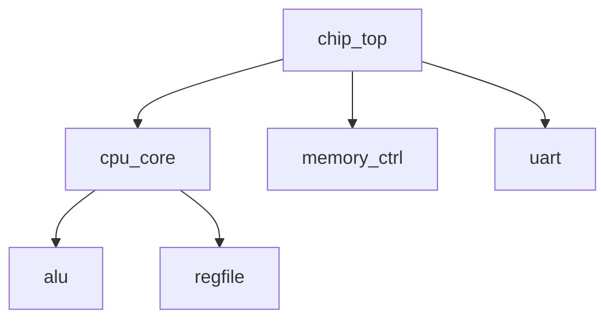
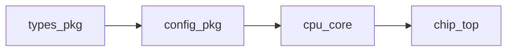
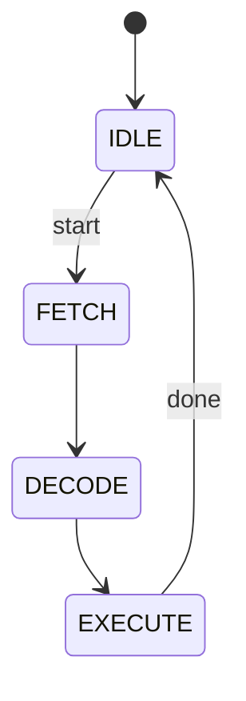
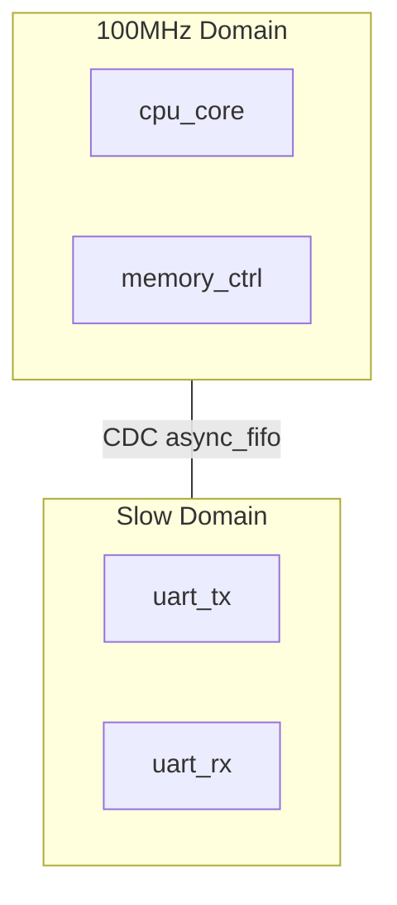

# GateFlow Map - Adaptive Codebase Cartographer

Map your SystemVerilog codebase using adaptive parallel agent swarms that scale based on project size and query type.

## Execution Modes

### Full Map (default)
```
/gf-map
```
Runs all relevant swarms based on project size. Creates complete SV_CODEBASE_MAP.md.

### Section-Specific
```
/gf-map hierarchy      # Swarm 1 only - modules, ports, parameters
/gf-map dependencies   # Swarm 4 only - compile order, cycles
/gf-map clocks         # Swarm 7 only - clock domains, CDC, reset
/gf-map packages       # Swarm 2 only - types, enums, structs
```

### Quick Scan
```
/gf-map --quick
```
Runs swarms 1, 4 only (structure + deps). Fast orientation for new codebases.

### Lite Mode (for Ollama/local models)
```
/gf-map --lite
```
Runs swarms 1, 4, 9 sequentially. Simpler prompts, no Mermaid diagrams.

## Model Selection

Ask user which model to use for swarms (cost vs accuracy tradeoff):

```
Which model for analysis swarms?

1. Haiku (Recommended) - Fast & cheap, good for most projects
2. Sonnet - Better accuracy, 10x more expensive
3. Opus - Best accuracy, 30x more expensive
```

Default: **Haiku** - best value for money

### Cost Estimates by Project Size (Haiku)

| Size | Files | Tokens | Swarms | Est. Cost |
|------|-------|--------|--------|-----------|
| Tiny | <10 | <10k | 2 | $0.02 |
| Small | 10-30 | <50k | 4 | $0.08 |
| Medium | 30-100 | <200k | 8 | $0.30 |
| Large | 100-500 | <1M | 10 | $1.50 |
| Huge | 500+ | >1M | 10-15 | $5.00 |

### Cost by Mode

| Mode | Swarms | Relative Cost |
|------|--------|---------------|
| `--quick` | 2 | 20% |
| `--lite` | 3 | 30% |
| Section-specific | 1-2 | 10-20% |
| Full map | All | 100% |

## Requirements

- **tiktoken** for accurate token counting: `pip install tiktoken`

## What It Creates

**Two files:**
1. **`docs/SV_CODEBASE_MAP.md`** - Full architecture documentation (31 sections)
2. **`CLAUDE.md`** - Updated with summary

Creates `docs/` directory if needed.

### Output Sections (31 Total)

**Metadata:** Quick Stats, System Overview, Directory Structure

**Structure:** Module Hierarchy, Module Documentation, Instance Map, Port Connections, Parameter Elaboration

**Types & Packages:** Packages, Interfaces, Type System, Enums, Clocking Blocks

**Verification:** Assertions (properties, sequences, covergroups)

**Dependencies:** Dependency Graph, Compile Order

**Timing & Flow:** Signal Flow, Clock Domains, Reset Tree

**Preprocessor:** Macros & Defines, Include Structure, Conditional Compilation

**Build:** Build System, File Statistics

**Quality:** Parse Errors & Warnings, Cross-Reference Index

**Patterns:** Coding Conventions, Architecture Patterns

**Guidance:** Gotchas & Warnings, Navigation Guide, Recommendations

### Mermaid Diagrams Included:

**Module Hierarchy:**


**Dependency Graph:**


**FSM States:**


**Clock Domains:**


## Instructions

### Phase 1: Discovery & Token Counting

Scan the project and count tokens with tiktoken:

```bash
# Find all SV files
find . -name "*.sv" -o -name "*.svh" -o -name "*.v" -o -name "*.vh" 2>/dev/null | grep -v node_modules

# Find recipes
find . -name "*.f" 2>/dev/null

# Count by type
echo "Modules: $(grep -r "^module " --include="*.sv" . | wc -l)"
echo "Packages: $(grep -r "^package " --include="*.sv" . | wc -l)"
echo "Interfaces: $(grep -r "^interface " --include="*.sv" . | wc -l)"
```

**Count tokens per file using tiktoken:**

```python
import tiktoken
import os

enc = tiktoken.get_encoding("cl100k_base")  # Claude's encoding

def count_tokens(file_path):
    with open(file_path, 'r') as f:
        return len(enc.encode(f.read()))

# Count all SV files
total_tokens = 0
file_tokens = {}
for root, dirs, files in os.walk('.'):
    for file in files:
        if file.endswith(('.sv', '.svh', '.v', '.vh')):
            path = os.path.join(root, file)
            tokens = count_tokens(path)
            file_tokens[path] = tokens
            total_tokens += tokens

print(f"Total tokens: {total_tokens:,}")
for path, tokens in sorted(file_tokens.items(), key=lambda x: -x[1])[:10]:
    print(f"  {path}: {tokens:,} tokens")
```

Report to user:
```
Scanning project...

Files:       45 SystemVerilog files
Modules:     32
Packages:    3
Interfaces:  5
Recipes:     2 filelists
Total tokens: 147,832

Largest files:
  src/cpu_core.sv: 12,450 tokens
  src/memory_ctrl.sv: 8,230 tokens
  ...

Estimated cost (Haiku): $0.22

Spawning 8 analysis swarms...
```

### Phase 2: Parse with Verible + Slang

Use MCP tools to get parsed data:
- `gf_find_all_sv_files` - file list
- `gf_get_project_stats` - counts
- `gf_get_dependencies` - dependency info

Or parse directly:
```bash
# Run verible on each file for CST
verible-verilog-syntax --printtree --export_json file.sv

# Run slang for semantic analysis
slang --ast-json - --ast-json-source-info *.sv
```

### Phase 3: Select and Spawn Swarms

**Swarm Selection Algorithm:**

1. Parse query for section triggers (hierarchy, dependencies, clocks, etc.)
2. If specific section requested, run only that swarm
3. Otherwise, scale based on project size:
   - Tiny (<10 files, <10k tokens): Swarms 1, 4
   - Small (10-30 files, <50k tokens): Swarms 1, 2, 4, 5
   - Medium (30-100 files, <200k): Swarms 1, 2, 3, 4, 5, 6, 7, 9
   - Large (100-500 files, <1M): All 10 swarms
   - Huge (500+ files, >1M): All 10, possibly split modules
4. For `--lite` mode: Swarms 1, 4, 9 only (sequential)

CRITICAL: Send ALL selected Task calls in ONE message for parallel execution.

```
[Swarm 1: Module Analysis]
Triggers: Always for full map, or "modules", "hierarchy", "ports"
subagent_type: "gateflow:sv-understanding"
model: [user_selected_model]
prompt: "Analyze modules using HierarchyBuilder and StructuralQueryProvider:
- Module declarations and purposes
- Port interfaces (direction, width, type)
- Parameters with evaluated values (from Slang)
- Internal signals and registers
- FSM detection using analyzeGeneratedCode()
- Always block types (always_ff, always_comb, always_latch)
- Generate blocks and instance counts
Output sections: 4, 5, 6, 7, 8"

[Swarm 2: Package & Type Analysis]
Triggers: "packages", "types", "enums", "typedefs"
prompt: "Analyze packages and type system:
- Package contents (types, functions, constants)
- Typedef, struct, union definitions with fields
- Enum definitions with values
- Import relationships and cross-package dependencies
Output sections: 9, 11, 12"

[Swarm 3: Interface & Protocol Analysis]
Triggers: "interfaces", "modports", "protocols", "AXI", "APB"
prompt: "Analyze interfaces (use WebSearch for protocol docs):
- Interface declarations and modport definitions
- Signal groups and directions
- Protocol detection (AXI, APB, Wishbone, custom)
- Clocking blocks
- Which modules use each interface
Output sections: 10, 13"

[Swarm 4: Dependency Analysis]
Triggers: "dependencies", "compile order", "cycles", "imports"
prompt: "Analyze with DependencyAnalyzer.buildGraph():
- File-to-file dependencies with reasons
- Compile order (topological sort)
- Circular dependency detection
- Impact analysis (what breaks if X changes)
- Unused/orphan files, root files, leaf files
Output sections: 15, 16, 26"

[Swarm 5: Macro & Directive Analysis]
Triggers: "macros", "defines", "includes", "ifdef"
prompt: "Analyze preprocessor using Verible Directive[]:
- `define macros (name, params, body, usage count)
- `include structure (who includes what)
- `ifdef/`ifndef guards, conditional compilation variants
- Timescale and pragma directives, macro conflicts
Output sections: 20, 21, 22"

[Swarm 6: Build & Recipe Analysis]
Triggers: "build", "recipes", "filelists", ".f files"
prompt: "Analyze build system:
- .f filelist structure, +incdir+ paths, +define+ flags
- Directory organization patterns, file naming conventions
- Missing or orphan files
- Build configurations (sim vs synth)
Output sections: 3, 23, 24"

[Swarm 7: Signal Flow & Timing]
Triggers: "signal flow", "data path", "clocks", "CDC", "reset", "pipeline"
prompt: "Analyze timing (use WebSearch for AXI/APB timing):
- Data path flows through design
- Clock domains and frequencies
- CDC crossings and mechanisms (async FIFO, sync, etc.)
- Reset tree and distribution
- Pipeline stages, latency through critical paths
Output sections: 17, 18, 19"

[Swarm 8: Assertion & Verification]
Triggers: "assertions", "properties", "sequences", "coverage"
prompt: "Analyze verification constructs:
- Property and sequence definitions
- Assertion usage (assert, assume, cover)
- Covergroups and checkers
- Constraint blocks
Output sections: 14"

[Swarm 9: Conventions & Patterns]
Triggers: "conventions", "style", "patterns", "naming"
prompt: "Analyze using detectNamingStyle() and analyzeGeneratedCode():
- Naming conventions (signals, modules, ports, params)
- Coding style (FSM style, reset style, clock edge)
- Detected patterns (FSM, pipeline, handshake, arbiter)
- File organization and comment style
Output sections: 27, 28"

[Swarm 10: Navigation & Recommendations]
Triggers: "navigation", "how to", "recommendations", "issues"
prompt: "Synthesize from all swarm outputs:
- How to add new modules / extend features
- Gotchas, warnings, parse errors
- Recommendations for improvement
- Non-obvious behaviors
Output sections: 25, 29, 30, 31"
```

### Phase 4: Collect Results

Wait for all selected swarms to complete. Each returns structured analysis for their output sections.

### Phase 5: Synthesize Documentation

Merge swarm reports into `docs/SV_CODEBASE_MAP.md` (only include sections from swarms that ran):

```markdown
# SystemVerilog Codebase Map

Generated: [date]
Tool: GateFlow Cartographer v2
Swarms: [N] (based on project size)

## Metadata
1. Quick Stats (files, modules, packages, interfaces, tokens)
2. System Overview (ASCII block diagram + Mermaid)
3. Directory Structure (annotated with token counts) [Swarm 6]

## Structure
4. Module Hierarchy (tree + Mermaid graph) [Swarm 1]
5. Module Documentation (per module: ports, params, signals) [Swarm 1]
6. Instance Map (who instantiates what, with locations) [Swarm 1]
7. Port Connections (per instance connections) [Swarm 1]
8. Parameter Elaboration (overrides and evaluated values) [Swarm 1]

## Types & Packages
9. Packages (contents, imports, usage) [Swarm 2]
10. Interfaces (modports, protocols, usage) [Swarm 3]
11. Type System (typedef, struct, union) [Swarm 2]
12. Enums (with values and usage) [Swarm 2]
13. Clocking Blocks (signals, skew) [Swarm 3]

## Verification
14. Assertions (properties, sequences, covergroups) [Swarm 8]

## Dependencies
15. Dependency Graph (Mermaid flowchart) [Swarm 4]
16. Compile Order (with rationale) [Swarm 4]

## Timing & Flow
17. Signal Flow (data path diagrams) [Swarm 7]
18. Clock Domains (tree + CDC crossings) [Swarm 7]
19. Reset Tree (distribution diagram) [Swarm 7]

## Preprocessor
20. Macros & Defines (with usage counts) [Swarm 5]
21. Include Structure (who includes what) [Swarm 5]
22. Conditional Compilation (ifdef variants) [Swarm 5]

## Build
23. Build System (recipes, flags, configs) [Swarm 6]
24. File Statistics (lines, tokens, parse time) [Swarm 6]

## Quality
25. Parse Errors & Warnings [Swarm 10]
26. Cross-Reference Index (entity lookup table) [Swarm 4]

## Patterns
27. Coding Conventions (detected style) [Swarm 9]
28. Architecture Patterns (FSM, pipeline, CDC, etc.) [Swarm 9]

## Guidance
29. Gotchas & Warnings (non-obvious behaviors) [Swarm 10]
30. Navigation Guide (how to extend) [Swarm 10]
31. Recommendations (improvements, issues) [Swarm 10]

## External References
[Links to protocol docs, IP references found via WebSearch]
```

### Phase 6: Update CLAUDE.md

Add summary to project's CLAUDE.md:

```markdown
## Codebase Map

See [docs/SV_CODEBASE_MAP.md](docs/SV_CODEBASE_MAP.md) for architecture docs.

- Top module: chip_top
- 32 modules, 3 packages, 5 interfaces
- Key patterns: 5-stage pipeline, AXI interfaces
```

## Update Mode

If `docs/SV_CODEBASE_MAP.md` exists:

```bash
# Check for changes since last map
git diff --name-only $(git log -1 --format=%H docs/SV_CODEBASE_MAP.md)..HEAD -- "*.sv" "*.svh" "*.f"
```

1. Parse only changed files
2. Determine affected sections from changes
3. Run only relevant swarms for those sections
4. Merge updates into existing doc
5. Update timestamp and stats

## Existing Code to Leverage

From gateflow-cli `src/indexer/analyzer/`:
```typescript
// Dependency analysis
import { DependencyAnalyzer } from './dependency-analyzer';
const deps = new DependencyAnalyzer(project);
const graph = deps.buildGraph();
const cycles = deps.detectCycles();
const order = deps.getCompileOrder();

// Hierarchy analysis
import { HierarchyBuilder } from './hierarchy-builder';
const hierarchy = new HierarchyBuilder(project);
const tree = hierarchy.buildTree();
const topModules = hierarchy.findTopModules();
```

From `src/memory/knowledge-service/`:
```typescript
// Structural queries
import { StructuralQueryProvider } from './structural-provider';
const module = await provider.findModule('counter');
const ports = await provider.getModulePorts('counter');
const instances = await provider.getInstancesInModule('top');
```

From `src/memory/knowledge-store/`:
```typescript
// Pattern analysis
import { detectNamingStyle, analyzeGeneratedCode } from './analysis-utils';
const style = detectNamingStyle(code);  // snake_case vs camelCase
const metadata = analyzeGeneratedCode(code);  // FSM states, DUT info
```

## Key Behaviors

- **Adaptive swarm count**: Scale 2-15 swarms based on project size and query
- **Parallel execution**: Spawn all selected swarms in ONE message
- **Query-aware**: "show hierarchy" runs only Swarm 1, "full map" runs all
- **Mode support**: --quick (2 swarms), --lite (3 sequential, Ollama-friendly)
- Use Haiku model by default (cost efficient)
- User can request Sonnet/Opus for more accuracy
- Leverage existing analyzers: HierarchyBuilder, DependencyAnalyzer, StructuralQueryProvider
- Use detectNamingStyle() and analyzeGeneratedCode() for pattern detection
- Respect .gitignore
- Create docs/ if needed

## Web Search Integration

Use WebSearch when encountering:
- Unknown protocols (AXI, APB, Wishbone, AHB) - fetch spec docs
- IP cores or vendor primitives - look up documentation
- Industry standards (AMBA, PCIe, USB) - get timing/protocol info
- Design patterns you don't recognize - find references
- Tool-specific syntax (Verilator, VCS pragmas) - check docs

Example searches:
```
WebSearch: "AMBA AXI4 protocol handshake timing diagram"
WebSearch: "Xilinx BRAM primitive interface"
WebSearch: "SystemVerilog assertion concurrent vs immediate"
```

This makes the map more accurate and includes links to relevant docs.
